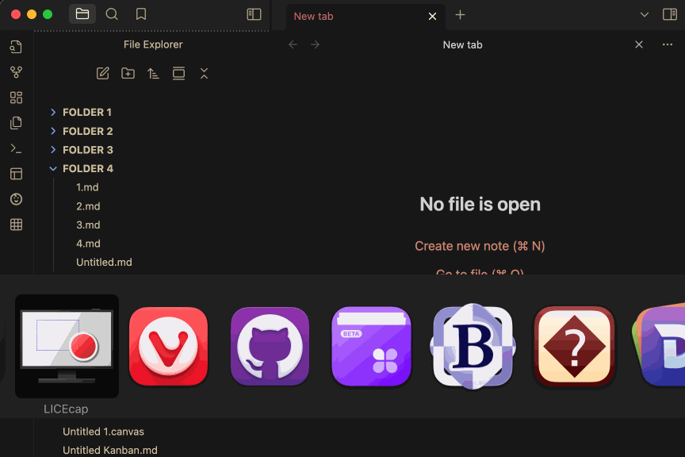

# highlight-open-files

This is a simple plugin for Obsidian that highlights all the File Explorer items that are currently open in the workspace. This is useful if you generally work with more than one tab open at a time, and is different from the functionality that plugins designed to reveal the current tab in the file explorer perform.

