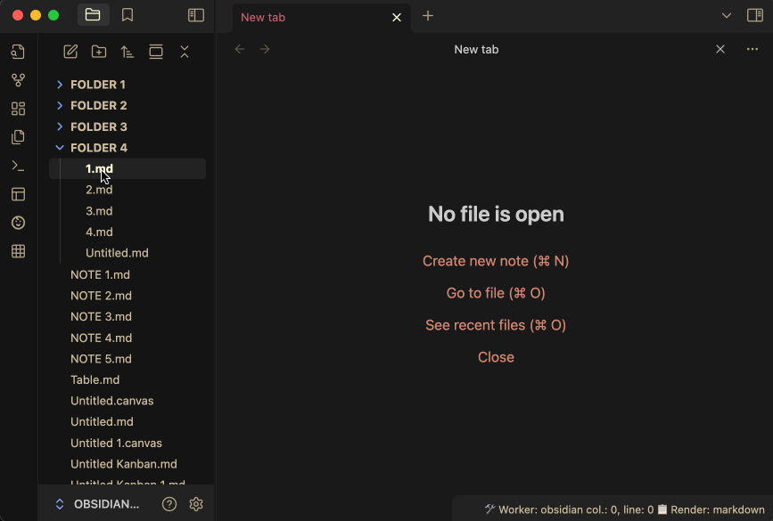

# mark-open-files

This is a ~~simple~~ slightly-more-than-simple plugin for Obsidian that adds a marker to all the File Explorer items that are currently open in the workspace. This is useful if you generally work with more than one tab open at a time, and is different from the functionality that plugins designed to reveal the current tab in the file explorer perform. 

• One marker is added for each instance of the open file.  

• Clicking a marker will make the corresponding leaf active.  

• The marker can be positioned after (default) or before the file name via the Settings.

Note: This screenshot includes some behavior handled by my "[Continuous Mode](https://github.com/gasparschott/obsidian-continuous-mode/)" plugin (q.v.).